# Gomotion

Gomotion is a research-driven motion design agent that creates animated videos from a single prompt using an agentic workflow.

---

## 🏗️ Architecture Overview



### High-Level Flow

```
User Prompt → AI Agent → Generated Remotion Code → Browser Bundler → Video Preview → Render Engine → MP4 Export
```

---

## 🤖 AI Agent System

The core intelligence of Gomotion lives in the **Animator Agent** (`src/lib/agent/`), a multi-attempt code generation system that transforms natural language prompts into complete Remotion video compositions.

### Agent Components

```
src/lib/agent/
├── animator.ts      # Core agent orchestration with retry logic
├── index.ts         # Public API exports
├── schema.ts        # Zod schema for structured output
├── types.ts         # TypeScript interfaces and input validation
└── prompts/
    ├── index.ts     # Prompt router based on context mode
    ├── classic.ts   # Minimalist Editorial Motion style
    ├── creative.ts  # Experimental/artistic style
    ├── narrative.ts # Story-driven content style
    ├── remix.ts     # Modification of existing compositions
    ├── fonts.ts     # Typography configuration
    └── mandatory.ts # Required instructions for all modes
```

### How It Works

1. **Input Processing**: User prompt + aspect ratio + context mode + optional images
2. **Prompt Engineering**: Selects appropriate system prompt based on context (`classic`, `creative`, `narrative`), or the `remix` prompt when `previousCode` is provided
3. **LLM Generation**: Uses OpenRouter API to generate structured JSON output via `ai` SDK
4. **Validation Loop**: Up to 5 retry attempts with error feedback for self-correction
5. **Output**: Complete multi-file Remotion project structure

### Agent Input Schema

```typescript
interface AnimatorInput {
  instruction: string; // User's prompt
  metadata?: string; // Video specs (width, height, fps)
  contextModel: "classic" | "creative" | "narrative";
  model: string; // LLM model via OpenRouter
  apiKey: string; // User's OpenRouter API key
  images?: string[]; // Optional base64 images for reference
  previousCode?: AnimatorOutput; // For remix/modification mode
}
```

### Agent Output Schema

```typescript
interface AnimatorOutput {
  title: string;
  meta: {
    width: number;
    height: number;
    fps: number;
    durationInFrames: number;
  };
  files: Record<string, string>; // File path → TypeScript/TSX code
}
```

---

## 📁 Project Structure

```
gomotion/
├── src/
│   ├── app/                          # Next.js App Router
│   │   ├── api/
│   │   │   ├── animations/
│   │   │   │   ├── create/           # Create new animation (calls agent)
│   │   │   │   ├── update/           # Update existing animation (calls agent in remix mode)
│   │   │   │   ├── delete/           # Delete animation
│   │   │   │   ├── fetch/            # Fetch single animation
│   │   │   │   └── fetch-all/        # Fetch all user animations
│   │   │   ├── auth/                 # Authentication endpoints
│   │   │   ├── lemonsqueezy/         # Payment webhooks
│   │   │   └── utils/                # API utilities (auth check, image encoding)
│   │   ├── explore/                  # Public gallery pages
│   │   ├── story/                    # Video editor/workspace pages
│   │   ├── pricing/                  # Pricing pages
│   │   └── [...auth pages]           # Sign-in, register, etc.
│   │
│   ├── components/
│   │   ├── ui/                       # Shadcn/Radix primitives
│   │   ├── prompt-input.tsx          # Main prompt interface
│   │   ├── context-selection.tsx     # Agent mode selector
│   │   ├── model-selection.tsx       # LLM model picker
│   │   ├── ratio-selection.tsx       # Aspect ratio selector
│   │   ├── images-upload/            # Image reference upload
│   │   ├── video-history.tsx         # User's video library
│   │   ├── custom-player.tsx         # Remotion player wrapper
│   │   └── settings-dialog/          # User settings (API keys)
│   │
│   ├── lib/
│   │   ├── agent/                    # 🤖 AI Agent (see above)
│   │   ├── bundle-code/              # Browser-side code bundling
│   │   │   ├── index.ts              # esbuild-wasm bundler
│   │   │   ├── externals-modules.ts  # Remotion/React external mapping
│   │   │   └── fonts.ts              # Google Fonts loading
│   │   ├── models.ts                 # LLM models offered in the picker (OpenRouter ids)
│   │   ├── web-renderer/             # In-browser MP4 rendering (@remotion/web-renderer)
│   │   ├── utils.ts                  # General utilities
│   │   └── blog-data.ts              # Static blog content
│   │
│   ├── store/                        # Zustand state management
│   │   ├── video.store.ts            # Video CRUD operations
│   │   ├── render.store.ts           # Render queue state
│   │   ├── params.store.ts           # Generation parameters
│   │   ├── auth.store.ts             # Authentication state
│   │   ├── user.store.ts             # User profile state
│   │   ├── checkout.store.ts         # Payment flow state
│   │   └── ui.store.ts               # UI state
│   │
│   ├── supabase/
│   │   ├── server.ts                 # Server-side Supabase client
│   │   ├── client.ts                 # Client-side Supabase client
│   │   ├── admin.ts                  # Admin Supabase client
│   │   ├── server-functions/         # Database operations
│   │   ├── client-functions/         # Client-side DB operations
│   │   └── generated/                # Auto-generated types
│   │
│   └── types/                        # Global TypeScript types
│
├── public/                           # Static assets
├── middleware.ts                     # Auth middleware
└── package.json
```

---

## 🔧 Key Technologies

| Layer             | Technology                   |
| ----------------- | ---------------------------- |
| **Framework**     | Next.js 15 (App Router)      |
| **AI/LLM**        | OpenRouter + Vercel AI SDK   |
| **Video Engine**  | Remotion 4.0                 |
| **Animation**     | GSAP                         |
| **State**         | Zustand                      |
| **Database**      | Supabase (PostgreSQL)        |
| **Auth**          | Supabase Auth                |
| **Payments**      | LemonSqueezy                 |
| **Styling**       | Tailwind CSS                 |
| **Code Bundling** | esbuild-wasm (in-browser)    |
| **3D Graphics**   | React Three Fiber + Three.js |

---

## 🔀 Data Flow

### Animation Generation Flow

```
1. User enters prompt in UI (prompt-input.tsx)
        ↓
2. Frontend submits to /api/animations/create
        ↓
3. API validates user & retrieves OpenRouter API key
        ↓
4. createAnimation() called (agent/animator.ts)
        ↓
5. Agent selects prompt based on context mode
        ↓
6. generateObject() sends to LLM via OpenRouter
        ↓
7. Response validated against AnimatorOutputSchema
        ↓
8. If error: retry with error feedback (up to 5 attempts)
        ↓
9. Success: save to Supabase videos table
        ↓
10. Return composition to frontend
        ↓
11. bundleCode() transpiles generated files (esbuild-wasm)
        ↓
12. Remotion Player renders preview in browser
```

### Animation Update Flow

When a video is open, submitting a new prompt modifies it instead of creating a new one.

```
1. User enters a change request in UI (prompt-input.tsx)
        ↓
2. Frontend submits to /api/animations/update with the video id
        ↓
3. API validates user, retrieves OpenRouter API key and loads the video from Supabase
        ↓
4. createAnimation() called with the current composition as previousCode
        ↓
5. Agent uses the remix prompt to apply minimal changes
        ↓
6. Updated composition saved to Supabase videos table
        ↓
7. Return composition to frontend, preview re-renders
```

### Video Export Flow

Export runs entirely in the browser, there is no server-side rendering.

```
1. User clicks "Export video" in UI
        ↓
2. bundleCode() transpiles the composition files (esbuild-wasm)
        ↓
3. renderVideo() renders and encodes frames (@remotion/web-renderer)
        ↓
4. Progress shown in UI (render.store.ts)
        ↓
5. MP4 downloaded directly by the browser
```

---

## 📊 Analytics

[Mixpanel Dashboard](https://mixpanel.com/project/3811560/view/4307644/app/boards#id=10406652)

---

## 🚀 Getting Started

Requires Node.js 24 and pnpm 12.8.1 (pinned in `package.json` under `packageManager`, and in the `Dockerfile`). Use pnpm only, `pnpm-lock.yaml` is the single lockfile.

```bash
# Install dependencies
pnpm install

# Set up environment variables
cp .env.example .env

# Run development server
pnpm dev

# Type checking
pnpm typecheck

# Build for production
pnpm build
```

### Environment Variables

All variables are listed in [`.env.example`](.env.example):

```env
# Supabase
NEXT_PUBLIC_SUPABASE_URL=
NEXT_PUBLIC_SUPABASE_ANON_KEY=
SUPABASE_SERVICE_ROLE_KEY=

# Public site URL, used for auth redirects
NEXT_PUBLIC_SITE_URL=http://localhost:3000

# LemonSqueezy (Payments)
LEMONSQUEEZY_API_KEY=
LEMONSQUEEZY_STORE_ID=
LEMONSQUEEZY_SIGNATURE_SECRET=

# Analytics
NEXT_PUBLIC_MIXPANEL_TOKEN=
```

No OpenRouter key is needed in the environment: each user adds their own key in the app settings, and the agent runs with it.

---

## 📝 License

Proprietary - All rights reserved.
